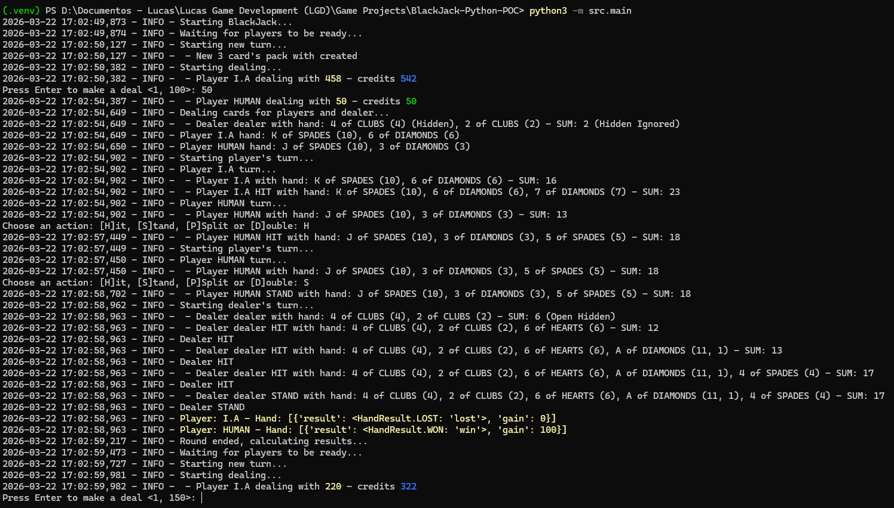
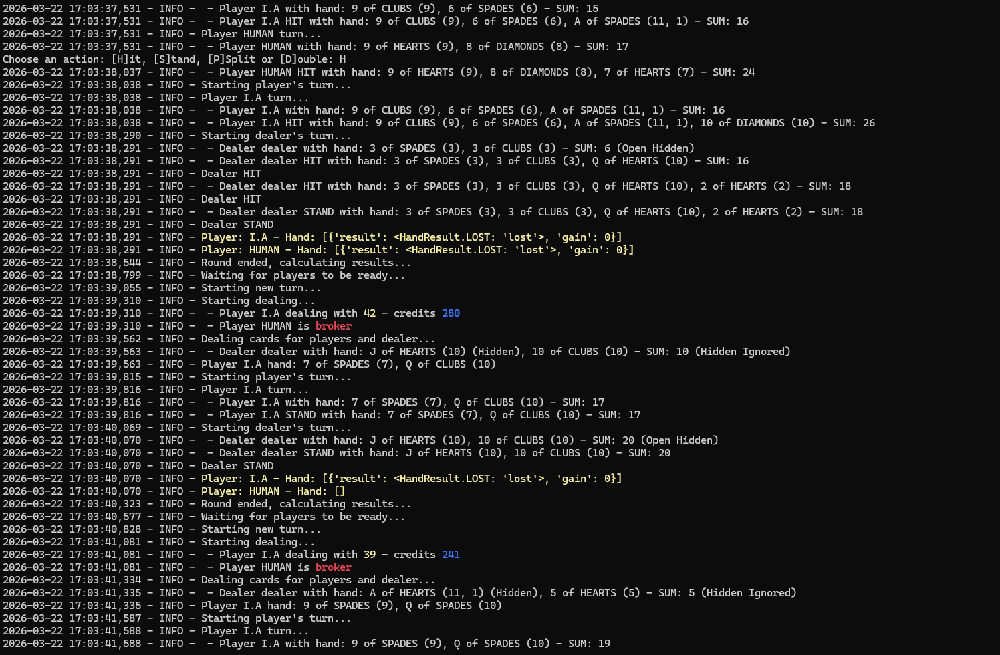

# 🎮 BlackJack Logic (POC)

Python Game Logic POC (Core Engine for Godot)
Esta é uma Prova de Conceito (POC) desenvolvida em Python para validar as mecânicas fundamentais e a lógica de sistemas de um futuro jogo no Godot Engine. O objetivo é garantir que as regras de negócio, cálculos matemáticos e fluxos de dados estejam sólidos antes da implementação da camada visual e de interface na engine.

## 🖼️ Preview do Projeto

| Interface de Testes 1 | Interface de Testes 2 |
| :---: | :---: |
|  |  |

# 🎯 Objetivos desta POC

Core Logic Decoupling: Desenvolver uma lógica de jogo 100% independente de bibliotecas gráficas.

Prototipagem de Algoritmos: Validar sistemas de [Ex: decisão da i.a, decisão do dealer, lógica da máquina de estado] usando a agilidade do Python.

Preparação para Migração: Estruturar classes e métodos que possam ser facilmente traduzidos para GDScript ou implementados via GDExtension.

Testes Unitários: Garantir a integridade das mecânicas através de testes automatizados (Pytest).

# 🏗️ Tecnologias

Linguagem: Python 3.x

Arquitetura: Orientação a Objetos (POO) focada em componentes.

# 🛠️ Instalação e Execução

1) Create the venv

```
python3 -m venv .venv
```

2) Activate venv

- Linux

```
source .venv/bin/activate
```

- Windows

```
.\.venv\Scripts\activate
```

3) Installation of requirements

```
pip install -r requirements.txt
```

4) Run the RetroGear - Engine

```
python3 -m src.main
```


